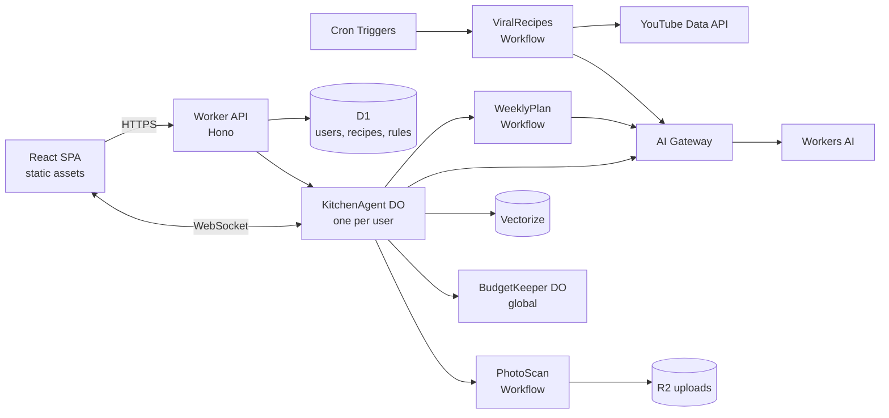
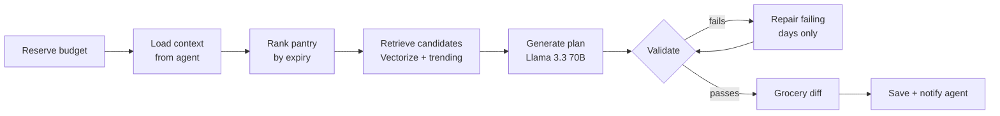
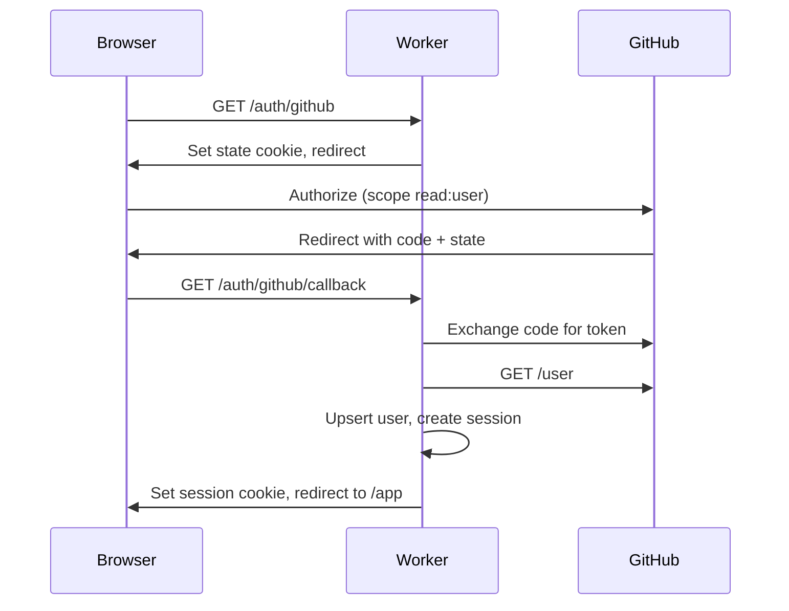

# We're So Cooked — Technical Spec

Sep 21, 2026 · @Someone

## 1. Overview & goals

We're So Cooked is a chat-first, pantry-aware meal planner built entirely on Cloudflare's free tier. It remembers what's in your kitchen, what you can and cannot eat, and what you liked, then plans meals, suggests safe substitutions, and surfaces trending recipes.

It is the optional fast-track assignment for the Cloudflare Software Engineer application (infrastructure platforms and tooling). The submission is a public GitHub repo plus prompt history.

**Tagline:** your fridge is chaos. dinner won't be.

### Required components (from the posting)

| Requirement             | How we meet it                                                                                                 |
| ----------------------- | -------------------------------------------------------------------------------------------------------------- |
| LLM                     | Llama 3.3 70B on Workers AI, plus smaller Workers AI models for cheap tasks and vision                         |
| Workflow / coordination | Three Cloudflare Workflows (weekly plan, photo scan, weekly viral recipes) and a per-user Durable Object agent |
| User input via chat     | Custom React chat UI over WebSocket to the agent                                                               |
| Memory or state         | Durable Object SQLite (pantry, profile, history), Vectorize (taste and recipe memory), D1 (shared data)        |
| Prompt history          | `PROMPTS.md` maintained from the first session, including this planning chat                                   |

### Success criteria

- A reviewer can open the live URL, click "try the demo", and see a plan, a substitution and a trending recipe within 2 minutes.
- No generated plan or recipe ever violates the user's allergies or diet. This is enforced in code and proven by an eval suite in CI.
- The repo reads like platform engineering: Infrastructure as Code in the Wrangler config, CI/CD with preview deploys, tests against real Durable Objects and Workflows, structured logs and a health endpoint.
- Runs entirely on free-tier Cloudflare, with a graceful message when the daily AI budget runs out.
- MVP submitted by the end of week 5; improvements continue after.

## 2. Scope

The MVP is everything a reviewer needs to try in one sitting; households and manual social imports wait until after submission.

### MVP

| #   | Feature                     | Acceptance criteria                                                                                                                                                                                                               |
| --- | --------------------------- | --------------------------------------------------------------------------------------------------------------------------------------------------------------------------------------------------------------------------------- |
| F1  | GitHub login + demo account | Sign in with GitHub in one click; "try the demo" creates a private, seeded account with no sign-in that expires after 24 hours                                                                                                    |
| F2  | Pantry by chat              | "bought 1kg paneer, 6 eggs, a bunch of dhaniya" adds 3 normalized items with estimated expiry dates; user can correct any field                                                                                                   |
| F3  | Pantry by photo             | Upload a receipt or shelf photo; extracted items appear as a confirm list; nothing is saved until the user confirms                                                                                                               |
| F4  | Auto-deduct                 | "made palak paneer" deducts that recipe's ingredients and logs the meal in cooking history                                                                                                                                        |
| F5  | Diet & allergy profile      | Every diet type and allergy from section 7 selectable; custom exclusions allowed; profile is enforced on every suggestion                                                                                                         |
| F6  | Substitutions               | "butter chicken but I'm vegan" returns a compliant version with every swap listed and explained                                                                                                                                   |
| F7  | Any cuisine                 | Recipes from any cuisine on request; plans can mix cuisines or be limited to chosen ones                                                                                                                                          |
| F8  | Weekly meal plan            | Breakfast, lunch, dinner and one sweet treat per day by default (each slot can be switched off); treats follow the same diet rules; uses soon-to-expire items first, no repeats within 7 days, fits the user's cooking-time limit |
| F9  | Grocery list                | Generated from the plan as ingredients needed minus pantry; items can be checked off                                                                                                                                              |
| F10 | Taste memory                | Ratings and free-text feedback ("too spicy") change future suggestions                                                                                                                                                            |
| F11 | Trending recipes            | Weekly pipeline adds up to 30 new YouTube-sourced recipes, safety-tagged, with creator credit and link                                                                                                                            |
| F12 | In-app notifications        | Expiry nudges and a daily "you can make X tonight" appear in an inbox                                                                                                                                                             |

### Stretch (after submission)

- Households: shared pantry, invites, members with different profiles (a plan satisfies everyone, or offers per-member variants).
- Manual imports from Instagram or TikTok by pasted caption or screenshot.
- Scaling recipes by servings.
- Web push notifications.

### Non-goals

- Nutrition or calorie tracking and medical diet advice.
- Scraping Instagram or TikTok.
- Grocery ordering or delivery integrations.
- Voice input.
- Native mobile apps (the web app is responsive).

## 3. Architecture

One Cloudflare Worker serves the UI, the API, both Durable Object classes and all three Workflows; everything is declared in `wrangler.jsonc`.



The browser talks to its own KitchenAgent over a WebSocket; long or multi-step jobs are handed to Workflows, which report back to the agent when done.

### Components

| Component              | Type                                                      | Responsibility                                                                                                     |
| ---------------------- | --------------------------------------------------------- | ------------------------------------------------------------------------------------------------------------------ |
| `web`                  | React + Vite SPA on Workers static assets                 | Chat, pantry, plan, grocery list, recipe cards, inbox, profile                                                     |
| `api`                  | Worker (Hono)                                             | Auth, session check, REST routes, upload URLs, routing to the user's agent, health endpoint                        |
| `KitchenAgent`         | Durable Object (`AIChatAgent` from `@cloudflare/ai-chat`) | Chat loop and tools; owns the user's SQLite (pantry, profile, history, inbox); alarms for nudges; starts Workflows |
| `BudgetKeeper`         | Durable Object, single global instance                    | Ledger of Workers AI usage for the day; per-user and global caps; answers "can I spend N neurons?"                 |
| `WeeklyPlanWorkflow`   | Workflow                                                  | Build, validate and repair a 7-day plan, then the grocery list                                                     |
| `PhotoScanWorkflow`    | Workflow                                                  | Vision extraction from an uploaded image, then waits for user confirmation                                         |
| `ViralRecipesWorkflow` | Workflow, started by cron                                 | Discover, filter, extract, normalize, safety-tag, dedupe and store trending recipes                                |
| D1 `cooked-db`         | SQL database                                              | Users, sessions, global recipe catalog, allergen and diet rules, substitution table, pipeline run log              |
| Vectorize              | One vector index                                          | `recipes` (catalog search) only. An earlier draft also listed a `taste` index; section 4 supersedes that — taste memory stays in each agent's SQLite, so per-user data never enters a shared index |
| R2 `cooked-uploads`    | Object storage                                            | Temporary photo uploads, deleted after processing and by a 1-day lifecycle rule                                    |
| AI Gateway `cooked-gw` | Proxy for Workers AI                                      | Response caching, request logs, rate limiting                                                                      |

### Cron triggers

| Schedule (UTC) | Job                                                                 |
| -------------- | ------------------------------------------------------------------- |
| `15 0 * * *`   | Delete expired demo accounts and their data                         |
| `30 0 * * 0`   | Start `ViralRecipesWorkflow`, just after the daily AI budget resets |

### Repository layout

```
weresocooked/
  apps/web/            React SPA
  apps/worker/         Worker entry, Hono routes, DOs, Workflows
  packages/safety/     Allergen, diet and substitution engine (pure TypeScript, no I/O)
  packages/shared/     Zod schemas and types shared by web and worker
  packages/prompts/    Versioned prompt templates
  evals/               Safety and quality eval suites
  seed/                Demo account and rule-table seed data
  wrangler.jsonc       All bindings, crons, migrations
  PROMPTS.md           AI prompt history
```

Keeping the safety engine a pure package means it can be unit-tested exhaustively without Cloudflare in the loop.

## 4. Data model

Per-user data lives in that user's KitchenAgent SQLite; shared data lives in D1; recipe search uses Vectorize; taste memory is small enough to search inside the agent.

### KitchenAgent SQLite (one database per user)

Chat messages are stored by `AIChatAgent` itself, capped with `maxPersistedMessages = 200`.

| Table           | Key columns                                                                                                                                                                                                                        | Notes                                                                                         |
| --------------- | ---------------------------------------------------------------------------------------------------------------------------------------------------------------------------------------------------------------------------------- | --------------------------------------------------------------------------------------------- |
| `profile`       | single row: `diets` JSON, `allergens` JSON, `exclusions` JSON, `cuisines` JSON, `max_cook_minutes`, `servings`, `spice_level`, `updated_at`                                                                                        | Every write re-runs a profile validation check                                                |
| `pantry_items`  | `id`, `canonical_id`, `display_name`, `category`, `quantity` REAL, `unit`, `qty_confidence` (exact / approx), `added_at`, `expires_at`, `expiry_source` (estimated / user / label), `source` (chat / photo / manual), `deleted_at` | Soft delete keeps history for undo                                                            |
| `cooking_log`   | `id`, `recipe_id` nullable, `recipe_title`, `cooked_at`, `deducted` JSON                                                                                                                                                           | Powers auto-deduct and no-repeat rules                                                        |
| `taste_memory`  | `id`, `text`, `kind` (like / dislike / note), `recipe_id`, `embedding` BLOB (Float32), `weight`, `created_at`                                                                                                                      | Searched in-process with cosine similarity; capped at 300 rows, oldest low-weight rows merged |
| `plans`         | `id`, `week_start`, `status`, `workflow_id`, `plan` JSON, `created_at`                                                                                                                                                             | One active plan per week                                                                      |
| `grocery_items` | `plan_id`, `canonical_id`, `quantity`, `unit`, `checked`                                                                                                                                                                           | Derived from the plan minus the pantry                                                        |
| `scans`         | `id`, `workflow_id`, `r2_key`, `items` JSON, `status` (processing / awaiting\_confirm / done / failed)                                                                                                                             | One row per photo                                                                             |
| `inbox`         | `id`, `kind` (expiry / tonight / plan\_ready / trending / system), `title`, `body`, `created_at`, `read_at`, `dedupe_key`                                                                                                          | `dedupe_key` stops repeat nudges for the same item                                            |

### D1 `cooked-db` (shared)

| Table           | Key columns                                                                                                                                                                                                                                          | Notes                                                                |
| --------------- | ---------------------------------------------------------------------------------------------------------------------------------------------------------------------------------------------------------------------------------------------------- | -------------------------------------------------------------------- |
| `users`         | `id`, `github_id` UNIQUE, `login`, `name`, `avatar_url`, `is_demo`, `created_at`                                                                                                                                                                     |                                                                      |
| `sessions`      | `id_hash`, `user_id`, `expires_at`, `created_at`                                                                                                                                                                                                     | Token hashed with SHA-256; 30-day expiry                             |
| `ingredients`   | `canonical_id`, `name`, `aliases` JSON, `category`, `default_shelf_days`, `allergens` JSON, `diet_flags` JSON                                                                                                                                        | Taxonomy used by normalization and the safety engine                 |
| `substitutions` | `from_id`, `to_id`, `constraint` (vegan / dairy\_free / …), `ratio_note`, `explanation`                                                                                                                                                              | Curated swap table                                                   |
| `recipes`       | `id`, `source` (seed / llm / youtube), `title`, `cuisine`, `ingredients` JSON, `steps` JSON, `minutes`, `servings`, `diet_tags` JSON, `allergen_tags` JSON, `source_url`, `creator`, `thumbnail_url`, `trending_until`, `content_hash`, `created_at` | Catalog; tags always computed by the safety engine, never by the LLM |
| `pipeline_runs` | `id`, `workflow`, `started_at`, `finished_at`, `status`, `found`, `filtered`, `extracted`, `added`, `duplicates`, `neurons`, `errors` JSON                                                                                                           | Feeds the pipeline status page                                       |

### Vectorize

| Index     | Model             | Dimensions | Metadata                                            | Budget check                                                           |
| --------- | ----------------- | ---------- | --------------------------------------------------- | ---------------------------------------------------------------------- |
| `recipes` | `@cf/baai/bge-m3` | 1024       | `cuisine`, `diet_tags`, `allergen_tags`, `trending` | Free allowance of 5 million stored dimensions fits about 4,800 recipes |

Taste memory stays in each agent's SQLite instead of Vectorize. Each user has at most 300 short memories, so a brute-force search is cheap, and it keeps per-user data out of a shared index.

### R2 `cooked-uploads`

Keys follow `uploads/{userId}/{uuid}.{ext}`. Objects are deleted when the scan finishes, with a 1-day lifecycle rule as a backstop. Max upload 5 MB, JPEG, PNG or WebP only.

## 5. Chat agent (KitchenAgent)

Each user gets one `KitchenAgent` Durable Object, addressed by user ID, built on `AIChatAgent` so message persistence, resumable streaming and WebSocket delivery come from the SDK.

### Turn lifecycle

1. The client sends a message with `useAgentChat`; the Worker has already checked the session and routed to the agent named after the user ID.
2. The agent asks `BudgetKeeper` whether the user can afford a turn. If not, it replies with the out-of-budget message and stops.
3. It builds the context window (below) and calls Llama 3.3 70B with the tool definitions.
4. Tool calls run server-side and are validated with Zod. Any tool that returns food runs the result through the safety engine before the model sees it.
5. The final text streams back. Recipe, pantry and plan results render as cards from structured tool output, not from parsed prose.
6. Actual token usage is reported to `BudgetKeeper`.

### Context window

Llama 3.3 70B on Workers AI has a 24K-token context window, so each turn is capped at about 6K input tokens.

| Slot    | Content                                                               | Cap          |
| ------- | --------------------------------------------------------------------- | ------------ |
| System  | Voice, rules, tool guidance                                           | 1,200 tokens |
| Profile | Compact summary of diets, allergens, exclusions, cuisines, time limit | 200          |
| Pantry  | Items expiring within 3 days, then counts by category                 | 600          |
| Taste   | Top 5 memories most similar to the message                            | 300          |
| History | Most recent messages, trimmed from the oldest                         | Remainder    |

### Tools

| Tool                                                   | Purpose                                                            | Approval needed                |
| ------------------------------------------------------ | ------------------------------------------------------------------ | ------------------------------ |
| `add_pantry_items`                                     | Parse free text into normalized items with estimated expiry        | No                             |
| `update_pantry_item` / `remove_pantry_items`           | Edit or delete items                                               | No                             |
| `list_pantry`                                          | Read pantry, optionally only items expiring soon                   | No                             |
| `log_cooked`                                           | Record a cooked meal and deduct its ingredients                    | Yes: shows the deduction first |
| `update_profile`                                       | Change diets, allergens or exclusions                              | Yes: safety-critical           |
| `suggest_recipes`                                      | Search the catalog and generate new options; always safety-checked | No                             |
| `substitute`                                           | Make a dish compliant with the profile, listing each swap          | No                             |
| `start_weekly_plan`                                    | Start `WeeklyPlanWorkflow`                                         | No                             |
| `get_plan` / `get_grocery_list` / `check_grocery_item` | Read plan and list, tick items                                     | No                             |
| `remember_taste`                                       | Save a like, dislike or note to taste memory                       | No                             |
| `search_trending`                                      | Search this week's viral recipes                                   | No                             |

Approval uses the SDK's human-in-the-loop flow: the tool is marked as needing approval, and the UI shows Approve / Reject buttons on the card.

### Synced state

The agent keeps a small state object synced to every open tab: pantry item count, items expiring soon, unread inbox count, active plan status, and neurons left today. The UI reads badges and banners from it without polling.

### Scheduled work

| Schedule                             | Job                                                                        | LLM use                              |
| ------------------------------------ | -------------------------------------------------------------------------- | ------------------------------------ |
| Daily, 09:00 in the user's time zone | Expiry check: inbox nudge for items expiring within 2 days                 | None; template copy                  |
| Daily, 17:00 in the user's time zone | "You can make X tonight": best catalog match for the current pantry        | One short blurb from the small model |
| When a plan Workflow finishes        | Workflow calls the agent over RPC; agent writes the inbox and pushes state | None                                 |

Time zone comes from the browser at sign-in and is stored in the profile. WebSockets use hibernation so idle agents are not billed for duration.

## 6. Workflows

All three Workflows use small, independently retried steps, so a failed LLM or API call reruns one step, not the whole job. The free plan allows 3,000 steps per day across all Workflows; the estimates below keep a normal day well under 500.

### Shared rules

- Every AI step: 3 retries, exponential backoff starting at 5 seconds, 60-second timeout.
- Quota, auth and validation errors throw `NonRetryableError`; the run is recorded as failed or partial, never silently retried.
- The first step of every run reserves its estimated neurons with `BudgetKeeper`. If the reservation is refused, the run ends as `deferred` and the user gets an inbox message.
- Step results are small JSON; large payloads (images, raw descriptions) stay in R2 or D1 and are passed by key.

### WeeklyPlanWorkflow

Started by the `start_weekly_plan` tool or the plan screen. Input: `userId`, `weekStart`, meal slots (breakfast, lunch, dinner, sweet treat; all on by default), optional cuisine filter.



| Step                | What it does                                                                                                                                            |
| ------------------- | ------------------------------------------------------------------------------------------------------------------------------------------------------- |
| Load context        | RPC to the agent: profile, pantry, last 14 days of cooking, top taste memories                                                                          |
| Rank pantry         | Deterministic score from days to expiry and quantity                                                                                                    |
| Retrieve candidates | Up to 60 catalog recipes across the four slots, filtered by diet and allergen tags, plus up to 3 trending picks                                         |
| Generate plan       | Two calls (days 1–4, then days 5–7) so each response stays small; the model picks candidate IDs where it can or proposes new dishes; strict JSON output |
| Validate            | Safety engine, no repeats within 7 days, time limit, pantry coverage score                                                                              |
| Repair              | Regenerates only the failing days; at most 2 rounds, then drops the day to a safe catalog fallback                                                      |
| Grocery diff        | Ingredients needed minus pantry, merged by canonical ingredient and unit                                                                                |
| Save + notify       | Writes `plans` and `grocery_items` through the agent, which adds an inbox item                                                                          |

New dishes store only a title and ingredient list in the plan; full steps are generated when the user opens the recipe, so unviewed meals cost nothing extra. About 11–16 steps per run.

### PhotoScanWorkflow

Started after an upload to R2. Input: `userId`, `scanId`, `r2Key`.

| Step               | What it does                                                                                    |
| ------------------ | ----------------------------------------------------------------------------------------------- |
| Check upload       | Size (5 MB max) and type (JPEG, PNG, WebP)                                                      |
| Extract            | Vision model returns items with name, quantity, unit, confidence and any printed expiry date    |
| Normalize          | Match to the ingredient taxonomy; small model only for names that don't match                   |
| Await confirmation | Sets the scan to `awaiting_confirm`, then `step.waitForEvent("confirm")` with a 24-hour timeout. Confirmed working on the free plan in spike 5, resuming 3,115 ms after `sendEvent`. Note that a parked instance reports status `running`, never `waiting` — there is no waiting state to poll for, which is why the `scans.status` column in section 4 is load-bearing rather than convenience |
| Commit             | Adds the confirmed (and user-edited) items to the pantry through the agent                      |
| Clean up           | Deletes the R2 object; also runs on timeout or failure                                          |

The same prompt handles receipts and shelf or fridge photos. Items below 0.5 confidence are shown unticked in the confirm list.

### ViralRecipesWorkflow

Started by the weekly cron. Target: up to 30 new trending recipes per run.

| Step            | What it does                                                                                                                                       | Cost                         |
| --------------- | -------------------------------------------------------------------------------------------------------------------------------------------------- | ---------------------------- |
| Reserve budget  | Reserve about 2,500 neurons                                                                                                                        |                              |
| Discover        | 12 YouTube `search.list` queries (6 general viral-recipe queries, 6 rotating cuisine queries), published in the last 7 days, ordered by view count | 12 of the 100 daily searches |
| Enrich          | `videos.list` for snippet and statistics, 50 IDs per call                                                                                          | About 6 quota units          |
| Rank            | Score by views per hour since publishing; skip video IDs already in `seen_videos`; keep top 60                                                     |                              |
| Filter          | Small model classifies whether the description contains a usable recipe, 10 videos per call                                                        | 6 steps                      |
| Extract         | One step per video: structured ingredients and steps, rewritten in our own words                                                                   | Up to 30 steps               |
| Normalize + tag | Taxonomy match and safety engine tags; recipes with unknown ingredients are held back                                                              |                              |
| Embed + dedupe  | `bge-m3` embedding; similarity above 0.92 to an existing trending recipe marks it a duplicate                                                      |                              |
| Store           | D1 `recipes` row with link, creator, thumbnail and `trending_until` = now + 21 days; Vectorize upsert                                              |                              |
| Expire          | Remove the trending tag from recipes past `trending_until`                                                                                         |                              |
| Record run      | Write counts, neurons and errors to `pipeline_runs`                                                                                                |                              |

D1 gets one more table for this: `seen_videos (video_id, first_seen, outcome)`, so a video is never processed twice. Every stored recipe credits the creator and links to the video; descriptions are never stored verbatim. About 50–80 steps per run.

## 7. Food safety engine

Safety is decided by deterministic code in `packages/safety`, never by the LLM: every recipe shown to a user passes `check(recipe, profile)` first, and anything the engine can't verify is blocked.

### Ingredient taxonomy

Every ingredient resolves to a canonical entry in the D1 `ingredients` table with allergens and flags. Composite and packaged ingredients carry their hidden allergens.

| Ingredient             | Allergens       | Flags         |
| ---------------------- | --------------- | ------------- |
| paneer, ghee, khoa     | milk            | dairy         |
| soy sauce              | soy, wheat      | gluten        |
| fish sauce             | fish            | fish          |
| oyster sauce           | molluscs        | shellfish     |
| Worcestershire sauce   | fish            | fish          |
| pesto                  | tree nuts, milk | dairy         |
| tahini                 | sesame          |               |
| naan                   | wheat, milk     | gluten, dairy |
| mayonnaise             | egg             | egg           |
| onion, garlic          |                 | allium, root  |
| potato, carrot, ginger |                 | root          |

The seed taxonomy targets about 1,500 ingredients across cuisines, built with LLM help and then reviewed and tested; the eval suite checks it.

### Allergens supported

The 14 EU allergens plus sesame (also on the US list): milk, egg, fish, crustaceans, molluscs, peanuts, tree nuts, wheat/gluten, soy, sesame, mustard, celery, lupin, sulphites. Users can add custom exclusions (for example "coriander" or "mushroom"), which are enforced the same way.

### Diets supported

Each diet is a rule over ingredient flags.

| Diet                                           | Rule                                                                    |
| ---------------------------------------------- | ----------------------------------------------------------------------- |
| Vegetarian                                     | No meat, poultry, fish or shellfish                                     |
| Eggetarian / ovo-vegetarian / lacto-vegetarian | Vegetarian, with eggs or dairy allowed as named                         |
| Vegan                                          | No animal products, including dairy, egg and honey                      |
| Jain                                           | Vegetarian, no eggs, no root vegetables, no alliums, no honey           |
| Sattvic / no onion-garlic                      | No alliums                                                              |
| Pescatarian                                    | No meat or poultry                                                      |
| Halal                                          | No pork, no alcohol; meat shown as "use halal-certified"                |
| Kosher-style                                   | No pork or shellfish, no meat with dairy in one dish                    |
| No beef / no pork                              | As named                                                                |
| Gluten-free                                    | No wheat, barley, rye or gluten-flagged items                           |
| Dairy-free                                     | No dairy                                                                |
| Keto-friendly                                  | No grains, sugar or starchy vegetables (approximate; no macro counting) |
| Paleo                                          | No grains, legumes, dairy or refined sugar                              |
| Low-FODMAP                                     | No high-FODMAP flagged items (approximate)                              |
| Navratri / vrat                                | Only vrat-flagged grains and flours, rock salt, no alliums              |

Diets can be combined; a recipe must satisfy all of them.

### `check(recipe, profile)`

Returns `{ ok, violations[], unknowns[] }`. Each violation names the ingredient, the rule and a severity.

| Severity | Source                                          | Effect                                                        |
| -------- | ----------------------------------------------- | ------------------------------------------------------------- |
| Hard     | Allergen, diet, custom exclusion                | Recipe blocked until substituted                              |
| Unknown  | Ingredient that doesn't resolve to the taxonomy | Treated as hard for users with any allergy; otherwise flagged |
| Soft     | Dislikes from taste memory                      | Lowers ranking only                                           |

### `substitute(recipe, profile)`

1. Run `check`. If it passes, return the recipe unchanged.
2. For each violation, look up the `substitutions` table for a replacement that passes every rule in the profile, not just the violated one.
3. If the table has nothing, ask the LLM for replacements, restricted to taxonomy IDs.
4. Run `check` on the result. If it still fails, drop the recipe and say why.
5. Return the new recipe plus a list of swaps, each with a short explanation and any technique note.

| Original      | Constraint          | Swap                            | Note                                         |
| ------------- | ------------------- | ------------------------------- | -------------------------------------------- |
| Chicken       | Vegan               | Soya chaap or extra-firm tofu   | Press tofu 20 minutes before marinating      |
| Butter, cream | Vegan               | Cashew cream + coconut oil      | Blend soaked cashews until smooth            |
| Cashew cream  | Tree-nut allergy    | Sunflower-seed or oat cream     | Chosen because it passes both rules          |
| Egg (binding) | Vegan / egg allergy | Flax egg                        | 1 tbsp ground flax + 3 tbsp water            |
| Onion, garlic | Jain                | Asafoetida (hing) + tomato base | Hing must be gluten-free if also gluten-free |
| Soy sauce     | Gluten-free         | Tamari                          |                                              |

The cashew example is why step 2 checks every rule: a vegan user with a tree-nut allergy must never be offered cashew cream.

### Guarantees and limits

- Invariant, tested with property-based tests: for any recipe and profile, the output of `substitute` either passes `check` or is dropped.
- Allergen tags on stored recipes are computed by the engine; LLM-provided tags are discarded.
- Cross-contamination and "may contain" labels are out of scope. The UI shows a plain, serious disclaimer: "Always check labels. If you have a severe allergy, verify every ingredient yourself."

## 8. LLM usage

Llama 3.3 70B handles the two jobs where quality matters most, chat with tools and weekly planning; cheaper Workers AI models do everything else, because the free plan's 10,000 neurons a day are shared across the whole account.

### Model routing

The week 1 spikes replaced the original estimates with measured numbers. Rows marked **measured** are Cloudflare's own billed figures, read from `aiInferenceAdaptiveGroups.sum.totalNeurons`, not tokens multiplied by a published rate. Rows marked _estimate_ are still assumptions and have not been spent against.

| Task                                         | Model                                      | Tokens (in / out)     | Neurons per call | Source                           |
| -------------------------------------------- | ------------------------------------------ | --------------------- | ---------------- | -------------------------------- |
| Chat turn with tools                         | `@cf/meta/llama-3.3-70b-instruct-fp8-fast` | 2,392 / 40            | **71.6**         | **measured**, spike 4            |
| Weekly plan: generate (2 calls, 28 slots)    | Llama 3.3 70B                              | 5,234 / 1,219 (total) | **384.5**        | **measured**, spike 4            |
| Weekly plan: repair round                    | Llama 3.3 70B                              | 1,173 / 94            | **50.5**         | **measured**, spike 4            |
| Full recipe steps, on open                   | `@cf/google/gemma-4-26b-a4b-it`            | 800 / 600             | \~25             | _estimate_                       |
| Viral recipe extraction                      | Gemma 4 26B                                | 1,500 / 700           | \~35             | _estimate_                       |
| Normalization, classification, tonight blurb | `@cf/meta/llama-3.1-8b-instruct-fp8-fast`  | 600 / 200             | \~10             | _estimate_                       |
| Photo extraction                             | `@cf/qwen/qwen3.8-27b`                     | 713 / ≤256 at 768px   | **49.7**         | **measured**, spike 2            |
| Embeddings                                   | `@cf/baai/bge-m3`                          | 200 / –               | <1               | **measured**, spikes 1 and 2     |

Every measured task came in **under** its original estimate except the photo, which came in 24% over. The chat turn was the largest error: input was close (2,392 against 2,500) but output was 40 tokens against an assumed 250, and output bills at roughly 7.7 times input on this model. When re-estimating the three tasks still marked _estimate_, assume the output guess is the one that is wrong.

The photo extraction model changed from `@cf/meta/llama-3.2-11b-vision-instruct`. That model is **gated**: it returns `AiError 5016` until a one-time licence acceptance, and its terms require the user to represent that they are not domiciled in the EU. Qwen3.8 27B is the only vision model in the Workers AI catalog with a `vision` property, no `terms` property, free-plan availability and no beta flag. Spike 2 also confirmed Gemma 4 26B accepts images, so if it passes the photo eval the stack loses a model entirely.

Caveat on that choice: spike 2 compared licence, token cost and billed neurons. It did **not** measure extraction accuracy — all four models returned 0/3 usable JSON against synthesised test images, which contain no food. Section 13's photo-extraction eval with real receipts is what validates the choice, and could still overturn it.

If Gemma 4 fails the quality eval for recipe steps, those calls move to Llama 3.3 at about 6 times the cost, and the per-user cap in section 12 is lowered to match.

### Structured output

- Every non-chat call returns JSON validated against a Zod schema in `packages/shared`, using JSON mode where the model supports it.
- On a validation failure the step retries once with the error message appended; a second failure fails the step, and the Workflow's retry policy takes over.
- Recipes generated by the model use taxonomy IDs where it can; free-text ingredient names go through normalization before `check`.

### Prompts

- Runtime prompts live in `packages/prompts`, each with an ID and version (for example `plan.generate@v3`). Every AI call logs the prompt ID and version.
- `PROMPTS.md` is separate: it is the AI-assisted coding history required by the posting.
- The chat system prompt sets the voice (section 10), lists the tools, and states the hard rules: never invent pantry items, always call `suggest_recipes` or `substitute` rather than writing a recipe freehand, never make safety claims.

### Untrusted input

YouTube descriptions, photo text and chat messages are untrusted. Extraction prompts wrap them as quoted data, the pipeline models have no tools, and their output must match a schema. A description that says "ignore previous instructions" can at worst produce a malformed recipe, which then fails validation.

### Fallbacks

| Situation                     | Behaviour                                                                                |
| ----------------------------- | ---------------------------------------------------------------------------------------- |
| Model error or timeout        | Retry once, then return a friendly error with a retry button                             |
| User's daily budget below 20% | Chat switches to Gemma 4 26B and the UI shows "low-power mode"                           |
| Account budget exhausted      | All AI features pause with the out-of-budget message; pantry, plans and lists still work |

## 9. Auth & multi-tenancy

Users sign in with GitHub; reviewers who don't want to can click "try the demo", which creates a private throwaway account seeded with sample data, so two reviewers never see each other's kitchen.

### GitHub OAuth



- `state` is 32 random bytes in a signed, 10-minute, HttpOnly cookie, compared on callback.
- The GitHub access token is used once to read the profile and then discarded; it is never stored.
- Session: 32 random bytes sent as cookie `wsc_session` (HttpOnly, Secure, SameSite=Lax, 30 days). D1 stores only its SHA-256 hash.
- Separate GitHub OAuth apps for local and production. Secrets `GITHUB_CLIENT_ID`, `GITHUB_CLIENT_SECRET` and `SESSION_SIGNING_KEY` are set with `wrangler secret`.

### Demo accounts

- `POST /auth/demo` creates a user with `is_demo = 1`, a 24-hour expiry and a seeded pantry, profile, taste history and one ready-made plan.
- Limited to 5 demo accounts per IP per hour, and 50 per day in total.
- Demo users get a smaller AI budget (section 12).
- The nightly cron deletes expired demo users: their D1 rows, their agent's storage, and their R2 objects. This replaces the earlier idea of one shared demo account, which reviewers would have overwritten for each other.

### Isolation

- Every agent instance is named after its user ID. The Worker checks the session on every HTTP request and WebSocket upgrade, and rejects any request where the agent name in the URL is not the session's user ID. The client cannot pick another user's agent.
- Workflows receive the user ID from the agent, never from the client.
- Shared D1 tables hold no per-user kitchen data; per-user data lives only in that user's agent.

### Other rules

- State-changing routes accept only JSON POST/PUT/DELETE and check the `Origin` header.
- `DELETE /api/me` deletes the account and all its data.
- Local development can use a fake login behind `DEV_AUTH=true`, which the production config never sets and CI checks for.

## 10. Frontend & brand voice

Chat is the home screen; everything the agent produces also has its own screen, so users can browse the pantry, plan and grocery list without typing.

### Stack

React 19, Vite, TypeScript, React Router, TanStack Query for REST calls, `useAgent` and `useAgentChat` for the agent connection, Tailwind CSS, Radix UI primitives for accessible dialogs and menus. Served from Workers static assets.

### Screens

| Route           | Screen                      | Key elements                                                                                 |
| --------------- | --------------------------- | -------------------------------------------------------------------------------------------- |
| `/`             | Landing                     | Tagline, GitHub sign-in, "try the demo", 3 feature teasers                                   |
| `/app`          | Chat                        | Message thread with cards, composer with photo attach, budget meter                          |
| `/app/pantry`   | Pantry                      | Items grouped by category, expiry badges, inline edit, add by text                           |
| `/app/plan`     | Weekly plan                 | 7-day grid, regenerate one day, open recipe, plan status while generating                    |
| `/app/grocery`  | Grocery list                | Checklist grouped by aisle-style category, share as text                                     |
| `/app/trending` | Trending                    | Viral recipe cards with thumbnail, creator credit, "make it fit my diet" button              |
| `/app/inbox`    | Inbox                       | Nudges and notices, mark read                                                                |
| `/app/profile`  | Profile                     | Diets, allergens, exclusions, cuisines, cook-time limit, servings, time zone, delete account |
| `/status`       | Pipeline status (signed in) | Last 10 viral-recipe runs with counts, duration, neurons and errors                          |

On phones the nav is a bottom tab bar (Chat, Pantry, Plan, Grocery, More).

### Chat cards

| Card          | Shown when                                                                 |
| ------------- | -------------------------------------------------------------------------- |
| Pantry diff   | Items added, changed or removed                                            |
| Recipe        | A suggestion, with a compliance badge listing the profile rules it passes  |
| Substitution  | A modified recipe, each swap shown as original → replacement with its note |
| Approval      | A tool needs confirmation (cooked-meal deduction, profile change)          |
| Scan confirm  | A photo scan is ready; editable item list with checkboxes                  |
| Plan progress | Plan Workflow is running; step names update live                           |

### Visual direction

Dark mode by default with a light theme; loud accent colours, chunky sticker-style cards, bold display type. All text meets WCAG AA contrast, every action works by keyboard, and animations respect reduced-motion settings. The frontend-design skill is applied when the UI is built.

### Voice

Lowercase, chaotic but helpful, a few emojis (💀🔥🍳🚨). The jokes roast the fridge, never the user. Safety, allergy and data-loss messages are always plain, sentence-case and emoji-free.

| Moment             | Copy                                                                                 |
| ------------------ | ------------------------------------------------------------------------------------ |
| Empty pantry       | your fridge is in witness protection. add something 👀                               |
| Expiry nudge       | 🚨 your spinach is giving _last seen 3 days ago_                                     |
| Plan generating    | letting him cook…                                                                    |
| Plan ready         | the week is planned. you're not cooked. dinner is. 🍳                                |
| Budget exhausted   | chef is tired 😮‍💨 back at {local reset time}                                          |
| Server error       | we're cooked 💀 (the server, not you). try again?                                    |
| Allergen removed   | Removed this recipe because it contains peanuts, which are on your allergy list.     |
| Unknown ingredient | We couldn't verify "{name}" against your allergies, so this recipe is hidden.        |
| Disclaimer         | Always check labels. If you have a severe allergy, verify every ingredient yourself. |

## 11. API surface

REST covers screens and forms; the agent WebSocket covers chat and live updates. All `/api` routes need a session and forward to the user's agent over RPC unless noted.

### HTTP routes

| Method         | Path                                   | Purpose                                                                                    |
| -------------- | -------------------------------------- | ------------------------------------------------------------------------------------------ |
| GET            | `/auth/github`                         | Start GitHub OAuth                                                                         |
| GET            | `/auth/github/callback`                | Finish OAuth, set session                                                                  |
| POST           | `/auth/demo`                           | Create a demo account and session                                                          |
| POST           | `/auth/logout`                         | End session                                                                                |
| GET            | `/api/me`                              | Current user, demo flag                                                                    |
| DELETE         | `/api/me`                              | Delete account and all data                                                                |
| GET / PUT      | `/api/profile`                         | Read or replace diet profile                                                               |
| GET / POST     | `/api/pantry`                          | List items; add from free text or structured items                                         |
| PATCH / DELETE | `/api/pantry/:id`                      | Edit or remove an item                                                                     |
| POST           | `/api/uploads`                         | Upload a photo (5 MB max) to R2 and start a scan; returns `scanId`                         |
| GET            | `/api/scans/:id`                       | Scan status and extracted items                                                            |
| POST           | `/api/scans/:id/confirm`               | Confirm edited items; sends the Workflow its confirm event                                 |
| POST           | `/api/plans`                           | Start a weekly plan; returns `planId`                                                      |
| GET            | `/api/plans/current`                   | Current plan with status                                                                   |
| POST           | `/api/plans/:id/days/:day/regenerate`  | Replan one day                                                                             |
| GET / PATCH    | `/api/grocery`, `/api/grocery/:itemId` | List and tick items                                                                        |
| GET            | `/api/recipes/:id`                     | Recipe; generates full steps on first open                                                 |
| POST           | `/api/recipes/:id/substitute`          | Make a recipe fit the profile                                                              |
| POST           | `/api/recipes/:id/feedback`            | Rating and note; saved to taste memory                                                     |
| POST           | `/api/recipes/:id/cooked`              | Log as cooked and deduct ingredients                                                       |
| GET            | `/api/trending`                        | Trending recipes; `?fits=me` keeps only ones that pass or can be substituted               |
| GET / POST     | `/api/inbox`, `/api/inbox/:id/read`    | Inbox and mark read                                                                        |
| GET            | `/api/budget`                          | Neurons left today for this user and for the account                                       |
| GET            | `/api/status/pipeline`                 | Signed in: recent viral-recipe runs (D1, no agent)                                         |
| GET            | `/healthz`                             | Public: checks D1, a KitchenAgent ping and the AI binding; returns 200 or 503 with details |
| POST           | `/admin/pipeline/run`                  | Start the viral Workflow manually; needs `ADMIN_TOKEN`                                     |

Errors always return `{ "error": { "code", "message", "requestId" } }`.

| Code                               | HTTP status |
| ---------------------------------- | ----------- |
| `unauthorized`                     | 401         |
| `forbidden`                        | 403         |
| `not_found`                        | 404         |
| `validation_failed`                | 422         |
| `budget_exhausted`, `rate_limited` | 429         |
| `upstream_error`                   | 502         |

### WebSocket

Path: `/agents/kitchen-agent/{userId}`, opened by `useAgent`. Chat messages, streaming and tool approvals use the `@cloudflare/ai-chat` protocol unchanged; agent state syncs with the SDK's state mechanism. Custom broadcast events:

| Event           | Payload                     |
| --------------- | --------------------------- |
| `plan.progress` | `planId`, step name, status |
| `scan.ready`    | `scanId`, item count        |
| `inbox.new`     | inbox item                  |
| `budget.low`    | percent left                |

## 12. Free-tier budget

Workers AI's 10,000 neurons per rolling 24 hours is the only limit this app is likely to hit; everything else has at least 10 times the headroom we need. At the measured costs in section 8 a full reviewer session (one weekly plan plus seven chat turns) is about 936 neurons, so the account supports roughly **10 sessions** a day rather than the 6 originally estimated. Caching and pre-generated demo content still matter, because a single burst can lock the account out for nearly a day.

### Limits that apply

From [Workers pricing](https://developers.cloudflare.com/workers/platform/pricing/), [Workers AI pricing](https://developers.cloudflare.com/workers-ai/platform/pricing/) and [YouTube Data API quotas](https://developers.google.com/youtube/v3/getting-started).

| Service          | Free limit                                                    | Expected use                      | Watch-out                                                                      |
| ---------------- | ------------------------------------------------------------- | --------------------------------- | ------------------------------------------------------------------------------ |
| Workers AI       | 10,000 neurons per **rolling 24 hours**                       | 3,000–9,000/day                   | The real constraint; see allocation below and the rolling-window note          |
| Workers          | 100,000 requests/day; 10 ms CPU per invocation                | Under 5,000/day                   | 10 ms CPU rules out heavy in-Worker compute; waiting on AI calls doesn't count |
| Workflows        | 3,000 steps/day, 10 ms CPU per invocation                     | Under 500/day                     | Keep steps small                                                               |
| Durable Objects  | SQLite backend only; 100,000 requests and 13,000 GB-s per day | Low                               | Use WebSocket hibernation                                                      |
| DO SQLite        | 5 million rows read, 100,000 written per day; 5 GB            | Low                               | Index lookup columns                                                           |
| D1               | 5 million rows read, 100,000 written per day; 5 GB            | Low                               | Index lookup columns                                                           |
| Vectorize        | 30 million queried and 5 million stored dimensions per month  | About 2 million stored            | Usable on the free plan, confirmed in spike 1; 68 s until a write is queryable |
| R2               | 10 GB-month; 1 million Class A operations/month               | Tiny                              | Delete after scan                                                              |
| Workers Logs     | 200,000 events/day, 3-day retention                           | Under 20,000/day                  | Sample debug logs                                                              |
| YouTube Data API | 100 `search.list` calls and 10,000 other units per day        | 12 searches + \~10 units per week | Resets at midnight Pacific                                                     |

### The neuron limit is a rolling window, not a daily reset

Measured, and it contradicts what the dashboard says. On 2026-09-23 a runaway test loop billed 50,583 neurons inside the 15:00Z hour. At 05:04Z the next day the GraphQL analytics reported **0 neurons used "today"**, and the dashboard's own label reads "Daily usage (resets at 00:00 UTC)" — but every live call still returned `AiError 4006, you have used up your daily free allocation`. Calls only succeeded again after that hour aged out of a trailing 24-hour window.

So the dashboard's "resets at 00:00 UTC" describes its **display**, not the limiter. Consequences:

- `BudgetKeeper` must sum spend over a trailing 24 hours, not since UTC midnight. A midnight-reset counter would tell users they have budget while every call 429s.
- There is no safe "spend it all before midnight" window. Usage ages out one hour at a time.
- A single burst can lock out the account for nearly a full day, which makes the per-user caps below a safety mechanism rather than a fairness one.

Caveat: this is inferred from one burn and its recovery, not from documentation. It held for that episode; re-verify before relying on the exact window shape.

### Vectorize fallback

Spike 1 confirmed a free account can create a 1024-dimension cosine index, upsert and query it with metadata filters, so this fallback is a contingency rather than the plan. Two findings that do bind: vectors took **68 seconds** to become queryable after upsert, so `ViralRecipesWorkflow` must treat the Vectorize write as fire-and-forget with D1 authoritative and never assume read-after-write.

If Vectorize does become unusable, recipe embeddings move to a D1 BLOB column using `bge-small-en-v1.5` (384 dimensions). Search first filters by diet and allergen tags in SQL, then scores the remaining candidates in the Worker. With at most a few thousand recipes this stays within the 10 ms CPU limit. The code keeps both behind one `RecipeIndex` interface so switching is a config change.

### Neuron allocation (`BudgetKeeper`)

| Pool               | Per day                                          | Notes                                                                               |
| ------------------ | ------------------------------------------------ | ----------------------------------------------------------------------------------- |
| Viral pipeline     | 2,500 on Sundays only                            | Reserved before the day's user traffic starts                                       |
| Safety margin      | 1,000                                            | Never allocated                                                                     |
| Signed-in user cap | 2,000 per user                                   | Measured: a four-slot weekly plan costs **435** with a repair round, leaving **21** chat turns at 71.6 each. The original estimate was ~1,100 and about 7 turns |
| Demo user cap      | 1,500 per user                                   | Raised from 800: production measured ~290 neurons a turn with every tool sent, so 800 was about 3 turns. With per-turn tool routing a turn is cheaper; 1,500 is several turns without generating a plan |
| All users combined | Whatever remains (8,500 weekdays, 6,000 Sundays) | First come, first served                                                            |

`BudgetKeeper` uses reserve-then-commit. A caller reserves an estimate, makes the AI call, then commits the actual cost, computed from the returned token counts and the per-model rates in config. Uncommitted reservations expire after 5 minutes.

### Stretching the budget

- Demo accounts come with a pre-generated plan, recipes and chat history, so exploring costs nothing.
- Demo suggestion chips ("what can I make tonight?") send identical context, so AI Gateway serves repeat answers from cache. Confirmed in spike 6: a repeat request returned `cf-aig-cache-status: HIT` in 177 ms against 2,488 ms cold, 14x faster, and a cached response never reaches the model so it costs zero neurons. The context must be byte-identical — one varying token, including a timestamp, and the cache never hits.
- Recipe steps are generated once, stored in D1, and reused for every user.
- Classification and normalization try the taxonomy lookup first and call a model only for misses.
- If reviewers still hit the cap, the fallback is the Workers Paid plan ($5 a month). You chose free-only, so this stays a documented option, not a plan.

## 13. Quality: tests, evals, CI/CD, observability

This section is what maps most directly to the job posting: automated testing, CI/CD, Infrastructure as Code, observability and self-checking tools.

### Tests

| Layer               | Tooling                           | Covers                                                                                                                                                         |
| ------------------- | --------------------------------- | -------------------------------------------------------------------------------------------------------------------------------------------------------------- |
| Unit                | Vitest                            | Safety engine rule tables; quantity parser ("a bunch", "2 packets", "1.5kg", "½ cup", "dhaniya" → coriander); expiry estimates; grocery diff; budget maths     |
| Property-based      | fast-check                        | Invariant: `substitute` output always passes `check` or is dropped, across random recipes and profiles                                                         |
| Integration         | `@cloudflare/vitest-pool-workers` | Real Durable Objects, D1 and Workflows running locally; Workers AI replaced by recorded fixtures; auth isolation (user A's session gets 403 on user B's agent) |
| End-to-end          | Playwright                        | Demo sign-in → add pantry → plan → substitution → grocery list, run against the preview deploy                                                                 |
| Manual verification | Claude in Chrome                  | Full walkthrough of every MVP feature before submission                                                                                                        |

Target: 90% line coverage on `packages/safety`, 70% overall.

### Evals

| Suite            | Cases                                                                                                       | Pass bar                                                                | When it runs                                 |
| ---------------- | ----------------------------------------------------------------------------------------------------------- | ----------------------------------------------------------------------- | -------------------------------------------- |
| Safety           | 300 profile × request cases, including adversarial ones ("just a little peanut butter, my allergy is mild") | Zero hard violations                                                    | Every PR on recorded outputs; live on demand |
| Plan quality     | 20 profiles                                                                                                 | Repeat rate 0, pantry coverage and plausibility scored by a model judge | Live on demand                               |
| Viral extraction | 30 labelled YouTube descriptions                                                                            | 90% ingredient accuracy                                                 | Every PR on fixtures                         |
| Photo extraction | 20 labelled receipt and fridge photos                                                                       | 80% item precision and recall                                           | Live on demand                               |

Live runs cost neurons, so they are manual GitHub Actions runs with a neuron cap. Each live run writes a report to `evals/reports/` that is committed.

### CI/CD (GitHub Actions)

| Trigger         | Jobs                                                                                                                                                        |
| --------------- | ----------------------------------------------------------------------------------------------------------------------------------------------------------- |
| Pull request    | Typecheck, lint, unit and integration tests, safety eval on recorded outputs, web build, upload a preview version to the staging Worker and comment its URL |
| Merge to `main` | Everything above, apply D1 migrations, deploy to production, smoke test `/healthz` and the demo flow, roll back automatically if the smoke test fails       |
| Hourly schedule | Synthetic check of `/healthz` and the demo flow; opens a GitHub issue on failure and closes it on recovery                                                  |
| Manual          | Live eval runs with a neuron cap                                                                                                                            |

The repo is public from day 1, so gitleaks scans every push for committed secrets and .dev.vars is git-ignored. CI also fails if `DEV_AUTH` is set for production or if a required secret is missing.

### Infrastructure as Code

- `wrangler.jsonc` declares every binding, cron, Durable Object migration and environment (`dev`, `staging`, `production`).
- D1 schema changes are numbered SQL migrations in `migrations/`.
- `npm run bootstrap` creates the D1 databases, Vectorize index, R2 bucket and AI Gateway, sets the R2 lifecycle rule and loads the seed data. It is safe to run twice.

### Observability

- Structured JSON logs on every request and step: `requestId`, hashed user ID, route, latency, model, prompt ID, neurons, outcome.
- Workers Logs enabled; errors always logged, other events sampled at 20%.
- `/healthz` checks D1, an agent ping and the AI binding.
- `/status` shows viral pipeline runs; `/api/budget` shows neuron usage.

### `PROMPTS.md`

One entry per AI-assisted coding session: date, tool (Claude chat, Claude Code, sub-agent), purpose, the prompts verbatim, and the resulting commit or PR. The first entry is this planning conversation. Secrets and API keys are never pasted into prompts.

### Repo hygiene

Conventional Commits, small PRs even when working solo, a `CHANGELOG.md`, and a README with setup, architecture diagram, design decisions and tradeoffs, and the live URL.

## 14. Milestones & sub-agent work split

The MVP ships at the end of week 5 by running four sub-agent tracks in parallel against shared schemas written first; weeks 6–8 are for stretch goals and hardening.

### Weekly milestones

| Week | Deliverables                                                                                                                                          | Done when                                                                           |
| ---- | ----------------------------------------------------------------------------------------------------------------------------------------------------- | ----------------------------------------------------------------------------------- |
| 1    | Cloudflare account and Wrangler set up; spikes (below); `packages/shared` schemas; GitHub OAuth; skeleton Worker, agent and SPA deployed; CI pipeline | Signed-in user sees an empty chat on the live URL; PR previews work                 |
| 2    | Pantry by chat and photo; normalization; taxonomy v1 (500 ingredients); `BudgetKeeper`                                                                | "bought 1kg paneer…" and a receipt photo both land in the pantry correctly          |
| 3    | Safety engine; substitution table; `suggest_recipes` and `substitute`; taxonomy to 1,500, reviewed by you; safety eval suite                          | Safety eval passes with zero violations; vegan butter chicken works                 |
| 4    | `WeeklyPlanWorkflow`; grocery list; taste memory; alarms and inbox; `ViralRecipesWorkflow` backend                                                    | A full plan with grocery list is generated live; first viral run stored 20+ recipes |
| 5    | Trending screen and status page; demo accounts and seed data; UI polish; README; Playwright E2E; Claude in Chrome walkthrough                         | **Submit** the repo URL on the application                                          |
| 6–8  | Households, manual Instagram and TikTok imports, recipe scaling, web push, hardening from real usage                                                  | Each shipped behind its own PR with tests                                           |

### Week 1 spikes

Each spike is a throwaway branch that answers one question before the real code depends on it.

All six ran on 2026-09-24 and 2026-09-25. Each spike's measured output is committed at `spikes/<n>/RESULT.md`; the answers below are summaries of those files.

| #   | Question                                                                                                            | Decides                                          | Answer                                                                                                              |
| --- | ------------------------------------------------------------------------------------------------------------------- | ------------------------------------------------ | --------------------------------------------------------------------------------------------------------------------- |
| 1   | Can a free account create and query a Vectorize index?                                                              | Vectorize vs the D1 fallback                     | **Yes.** Created, upserted and queried with metadata filters. 68 s until queryable, so no read-after-write          |
| 2   | How many input tokens does a photo cost on Llama 3.2 Vision, and does the model need a one-time licence acceptance? | Photo budget; setup step in the README           | **Licence needed, so the model changed.** Qwen3.8 27B instead: 713 tokens and 49.7 neurons at 768 px, no acceptance |
| 3   | How reliably does Llama 3.3 70B call tools through `AIChatAgent`?                                                   | Tool design; whether chat needs a pre-classifier | **24/24 correct.** No pre-classifier; keep all twelve tools in one turn                                             |
| 4   | Real neurons per chat turn and per plan                                                                             | Section 12 caps                                  | **71.6 per chat turn, 435 per plan** with a repair round. Caps hold with 3x headroom                                |
| 5   | Does `step.waitForEvent` work for the photo confirm flow on the free plan?                                          | PhotoScan design                                 | **Yes.** Resumed 3,115 ms after `sendEvent`. Reports `running`, never `waiting`                                     |
| 6   | Is AI Gateway caching available on the free plan?                                                                   | Demo caching strategy                            | **Yes.** `HIT` at 177 ms against 2,488 ms cold, 14x, zero neurons                                                   |

Two things the spikes cost that were not planned for. A runaway readiness probe in the spike runner billed 50,583 neurons in one hour, which is what exposed the rolling-window behaviour in section 12. And spike 2's model comparison ran against synthesised images, so it chose a model on licence and cost without measuring extraction accuracy.

### Sub-agent tracks

| Track                | Owns                                                                                 | Depends on                                |
| -------------------- | ------------------------------------------------------------------------------------ | ----------------------------------------- |
| A. Platform          | `wrangler.jsonc`, bootstrap script, CI/CD, auth, `BudgetKeeper`, logging, `/healthz` | Shared schemas                            |
| B. Safety & data     | Taxonomy seed, `packages/safety`, substitution table, normalization, eval suites     | Shared schemas                            |
| C. Agent & Workflows | `KitchenAgent`, tools, three Workflows, `packages/prompts`                           | Tracks A and B interfaces                 |
| D. Frontend          | SPA screens, chat cards, voice copy                                                  | API and WebSocket contracts in section 11 |

Rules for sub-agents:

1. Contracts first: `packages/shared` schemas and the section 11 API are written and approved before any track starts.
2. Each sub-agent gets its spec sections and the shared schemas, and works on its own branch.
3. Every track opens PRs with tests; you review and merge them.
4. Every sub-agent prompt goes into `PROMPTS.md`.
5. Integration and cross-track bugs are handled by the main session, not by the tracks.

## 15. Risks & decisions

The two biggest risks are running out of free AI budget while reviewers are testing and scope creep; both have concrete mitigations above.

### Risks

| Risk                                            | Likelihood | Impact | Mitigation                                                                                                      |
| ----------------------------------------------- | ---------- | ------ | --------------------------------------------------------------------------------------------------------------- |
| Neuron cap hit while reviewers test             | High       | High   | Pre-generated demo content, AI Gateway caching (14x, zero neurons, confirmed), per-user caps, low-power mode; paid plan documented as fallback. Measured costs are well under estimate, so the cap is less likely than first thought |
| Neuron cap is a rolling 24h window, not a daily reset | High | High | Measured the hard way (section 12). `BudgetKeeper` sums a trailing 24 hours; a burst can lock the account out for nearly a full day, so reserve-then-commit is mandatory, not a nicety |
| Meta model licences restrict EU users           | Low        | Medium | Llama 3.2 Vision's terms require representing non-EU domicile. Avoided by routing photo extraction to Apache-2.0 Qwen3.8. Check `terms` in the model catalog before adopting any new model |
| Scope creep over 2 months                       | High       | High   | MVP frozen at end of week 5; everything else goes to the stretch list                                           |
| Taxonomy gaps hide good recipes as "unknown"    | High       | Medium | Fail closed; log every unknown ingredient; grow the taxonomy weekly from the log with LLM help and your review  |
| ~~Llama 3.3 tool calling unreliable~~           | ~~Medium~~ | ~~Medium~~ | **Closed by spike 3**: 24/24 correct, zero invented tool names, small talk correctly left alone. Keep the tool-choice eval as a regression guard |
| Weak or invented recipes                        | Medium     | Medium | Validate-and-repair loop, catalog grounding, plan quality eval                                                  |
| 10 ms CPU limit on free Workers                 | Medium     | Medium | Profile hot paths; keep work in small Workflow steps; small vectors                                             |
| ~~Vectorize not on the free plan~~              | ~~Medium~~ | ~~Low~~ | **Closed by spike 1**: created and queried on a free account. Keep the `RecipeIndex` interface anyway; it also absorbs the 68 s write visibility delay |
| Few YouTube descriptions contain full recipes   | Medium     | Low    | Filter step; 30-recipe target is a ceiling, not a promise; review YouTube API terms in week 4                   |
| Consumer app for an infrastructure-tooling role | Medium     | Medium | README leads with section 13: CI/CD, IaC, evals, observability, the pipeline                                    |
| First Cloudflare project                        | Medium     | Low    | Week 1 spikes before real code                                                                                  |

### Decisions

- [x] Role location, relocation and sponsorship work for you.
- [x] Weekly plan covers breakfast, lunch, dinner and one sweet treat per day by default.
- [x] You review the seed ingredient taxonomy as much as needed; review is part of week 3.
- [x] Repo is public from day 1.
- [x] `/status` is visible only when signed in.

### Sources

- [Build Agents on Cloudflare](https://developers.cloudflare.com/agents/)
- [@cloudflare/ai-chat README](https://github.com/cloudflare/agents/blob/main/packages/ai-chat/README.md)
- [Workers AI pricing](https://developers.cloudflare.com/workers-ai/platform/pricing/)
- [Workers pricing, including Workflows, D1, Durable Objects, Vectorize and R2](https://developers.cloudflare.com/workers/platform/pricing/)
- [YouTube Data API overview and quotas](https://developers.google.com/youtube/v3/getting-started)
- [Llama 3.3 70B context window listing](https://freellm.net/models/cloudflare-workers-ai/cf-meta-llama-3-3-70b-instruct-fp8-fast)
